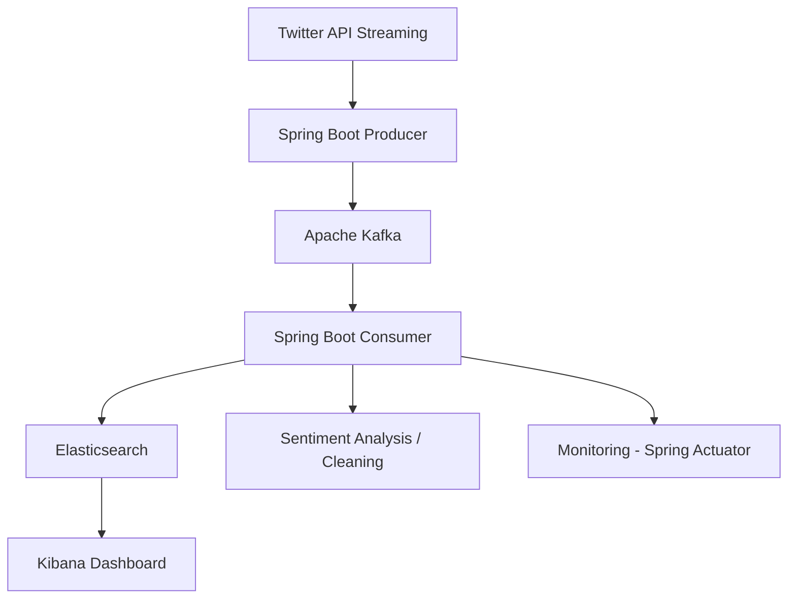

# 🐦 Tweet Tracker - Real-Time Twitter Data Pipeline

A complete project to collect, process, store, and visualize tweets in real time. This modular architecture is designed to be scalable, resilient, and easily deployable.

## 🚀 Objective

The goal of this project is to track tweets in real-time via the Twitter (X) API, apply transformations such as cleaning and sentiment analysis, index them in **Elasticsearch**, and visualize them using **Kibana**. This data pipeline allows for continuous analysis of Twitter trends while offering an interactive visual interface.

---

## 🧱 Tech Stack

| **Component**   | **Technology Used**              |
|-----------------|----------------------------------|
| **Collection**  | Twitter API (Streaming)          |
| **Backend**     | Spring Boot                      |
| **Messaging**   | Apache Kafka                     |
| **Processing**  | Spring Boot (Kafka Consumer)     |
| **Storage**     | Elasticsearch                    |
| **Visualization**| Kibana                           |
| **Monitoring**  | Spring Actuator                  |
| **Deployment**  | Docker / Docker Compose (optional)|

---

## 🗂️ Architecture



## ⚙️ **Spring Boot + Kafka**

This section walks you through setting up the **Spring Boot microservice** responsible for ingesting tweets and sending them into the **Apache Kafka** pipeline.

---

### 🟢 **Start the Spring Boot Microservice**  
> 📍 _Service: `Tweet Ingestor`_

To get the microservice up and running:

```bash
cd tweet-ingestor
./mvnw spring-boot:run
```
This will start the Tweet Ingestor, which listens to the Twitter stream and pushes messages to Kafka.

🛠️ Make sure your Kafka broker is up and running before launching the service.

## 🐳 **Docker Setup**  
> _Run Kafka, Elasticsearch & Kibana effortlessly using Docker Compose_

If you're using Docker to spin up **Kafka**, **Elasticsearch**, and **Kibana**, follow these steps:

---

### 🚀 **Start Services with Docker Compose**

```bash
docker-compose up -d
# or, to rebuild containers
docker-compose up --build
```
## 🧪 **Kafka CLI Testing**

Use the following commands to create a Kafka topic and test the producer/consumer flow inside your Docker environment.

---

### 📌 **Create a Topic**

```bash
docker exec -it kafka kafka-topics \
  --create \
  --bootstrap-server localhost:29092 \
  --replication-factor 1 \
  --partitions 1 \
  --topic test-topic
```
### 🧾 **Test Kafka Consumer**

To consume messages from your Kafka topic from the beginning:

```bash
docker exec -it kafka kafka-console-consumer \
  --bootstrap-server localhost:29092 \
  --topic test-topic \
  --from-beginning
```
### 📨 **Test Kafka Producer**

To send messages manually into your Kafka topic:

```bash
docker exec -it kafka kafka-console-producer \
  --broker-list localhost:29092 \
  --topic test-topic
```
💡 This setup is ideal for local development, debugging, and confirming that your Kafka message pipeline works end-to-end.

## 🔎 **Test Elasticsearch & Kibana**

Make sure your services are up and reachable by hitting their respective endpoints:

---

### 🧠 **Test Elasticsearch**

```bash
curl -X GET http://localhost:9200
```
### 📊 **Test Kibana**

To check if Kibana is running and healthy:

```bash
curl -X GET http://localhost:5601/api/status
```

## 📊 **Kibana Visualization**

Visualize tweets in **Kibana** after they’re ingested into **Elasticsearch**.

---

### 📝 **Create Index Pattern**

- Go to **Kibana** > **Management** > **Index Patterns** > **Create Index Pattern**.
- Use `tweets*` as the pattern.

---

### 📊 **Create Visualizations**

- Go to **Kibana** > **Visualize** > **Create New Visualization**.
- Choose a visualization type (e.g., **pie chart**, **bar chart**) and select the data.

---

### 🧠 **Sentiment Analysis Visualization**

- Visualize sentiment distribution (positive, negative, neutral) once integrated and indexed.

## 💻 **Development Setup**
### 1. Install Dependencies

```bash
./mvnw clean install
```
### 2. Configure Twitter API

- Obtain your **Twitter API Bearer Token**.
- Set it in a `.env` file:

```
TWITTER_API_BEARER_TOKEN=your_bearer_token_here
```
### 3. Run the Spring Boot Application

```bash
./mvnw spring-boot:run
```

## 📚 **Resources**

- **Twitter API Documentation**: [Twitter Developer](https://developer.twitter.com/)
- **Apache Kafka Documentation**: [Apache Kafka](https://kafka.apache.org/documentation/)
- **Elasticsearch Documentation**: [Elasticsearch](https://www.elastic.co/guide/en/elasticsearch/reference/index.html)
- **Kibana Documentation**: [Kibana](https://www.elastic.co/guide/en/kibana/index.html)


